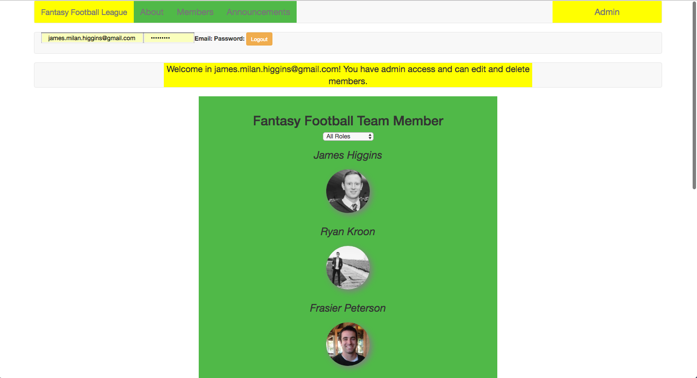
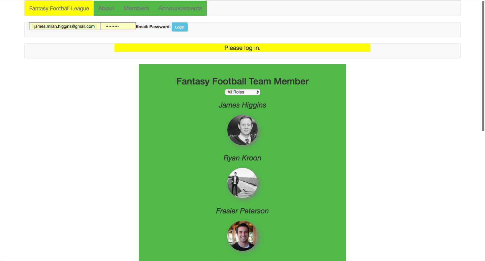
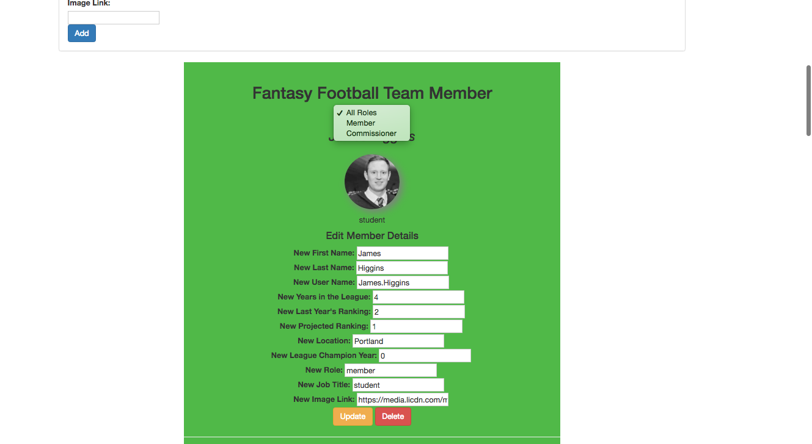

# Fantasy Football League Manager

#### _This app lets admins of a fantasy football league, add edit and delete members. Members can view the other members and the details._

#### By _**James Higgins**_

## Description

_Users can click on the listed members to view the specific members details. Admins can add, edit and delete members from the league. Users and admins can filter members based on their role, member or commissioner._

## Setup/Installation Requirements

### Firebase Integration

* Create a firebase account at `https://firebase.google.com`
* Add a new project to your firebase account
* Create a file in the app folder labeled api-keys.ts
* Add the following to your api-keys file:

`export var masterFirebaseConfig = {
    apiKey: "xxxx",
    authDomain: "xxxx.firebaseapp.com",
    databaseURL: "https://xxxx.firebaseio.com",
    storageBucket: "xxxx.appspot.com",
    messagingSenderId: "xxxx"
  };
`
### Access Atom Files

* _Ensure connection to the Internet_
* _On a mac using spotlight search type in terminal_
* _Once in terminal enter the following commands to clone the file to your desktop and open the repository:_
```
$ cd desktop
$ git clone https://github.com/jamesmilanhiggins/club-manager
$ cd club-manager
$ npm install
$ bower install
$ ng serve
$ open localhost:4200 in your browser
```
or visit live site [here](https://marcusisonline2.firebaseapp.com)
Note: You can log in with the test email: "testemail@gmail.com" and the password: "12456" to view the admin capabilities.

## Known Bugs

* There are no known bugs at this time*


## Support and contact details

_Please contact James Higgins at James.Milan.Higgins@gmail.com if you have any questions._

## Technologies Used

* JavaScript
* Angular
* Node
* Bower
* HTML
* Bootstrap
* Firebase

### License

*This software is licensed under MIT license.*

Copyright (c) 2017 **_James Higgins**




